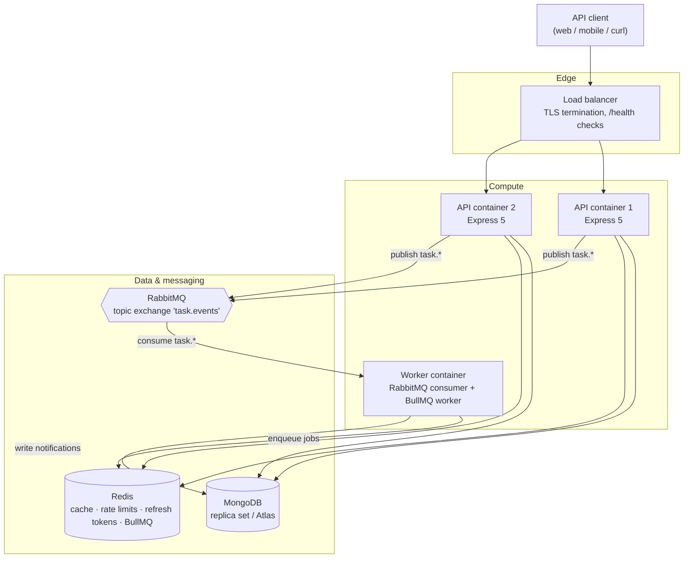
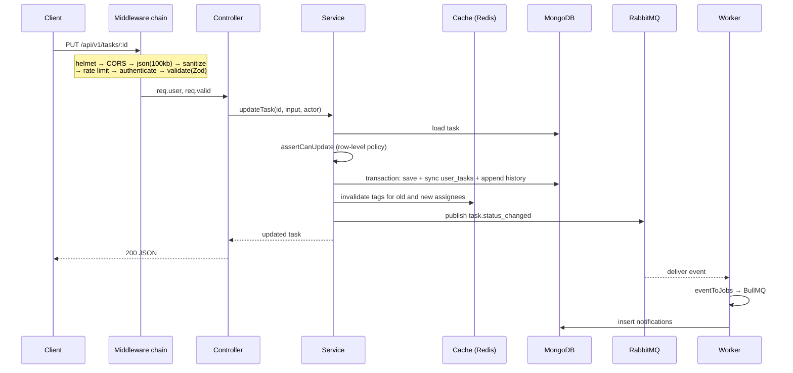

# Architecture

## System overview



The API containers are stateless — every piece of session state lives in Redis
or Mongo — so they scale horizontally and a rolling deploy replaces them without
coordination. The worker is a separate container running the same image with a
different command, which means notification bursts cannot starve the request
event loop, and the two scale independently.

## Request lifecycle



The ordering matters in two places. Authorisation runs **after** the record is
loaded, because the interesting rules are about the record, not the route. And
the cache invalidation and the event publish both happen **after** the write has
committed — publishing first would announce a change that could still roll back.

## Layering

```
routes → middleware → controller → service → repository/model
```

- **Routes** wire paths to middleware and a handler. No logic.
- **Middleware** handles cross-cutting concerns: headers, CORS, body limits,
  sanitization, rate limiting, authentication, Zod validation.
- **Controllers** translate HTTP to a service call and back. They never touch
  Mongoose.
- **Services** own business logic: authorisation, transactions, audit writes,
  cache invalidation, event publication.
- **Models** are Mongoose schemas plus index declarations.

The rule that earns its keep: **row-level authorisation lives in the service,
not the middleware.** `requireRole` on a route can say "no plain user may call
DELETE"; only the service, holding the loaded document, can say "this manager
may not touch that task". Putting the check in the service means a route added
later without the right middleware still cannot leak data.

## Why both RabbitMQ and BullMQ

This is the question the design invites, so it is worth answering directly:
they carry different things.

**RabbitMQ carries facts.** `task.status_changed` happened. The publisher does
not know or care who is listening. A reporting service, an audit sink or a
Slack integration can bind to the `task.events` topic exchange tomorrow without
a single line changing in the task service. That decoupling is the entire
purpose of the exchange.

**BullMQ carries work.** "Deliver this notification to this user" is a unit of
work with an owner, and it needs per-job retries, exponential backoff, a
dead-letter path and a way to inspect what failed. Those are queue semantics,
not event semantics.

Collapsing them would mean giving up one or the other: either the publisher
becomes coupled to every downstream consumer, or notification delivery loses its
retry story. The worker is the seam — it consumes facts and produces work.

Both failure paths are non-fatal by design. If RabbitMQ is unreachable the write
still succeeds and the event is logged and dropped: the audit trail is in Mongo,
so nothing is lost that matters. If Redis is unreachable, the cache degrades to a
miss and the request is served from the database.

## Caching

Key: `tasks:user:{userId}:{sha1(canonical query params)}`, TTL 300s.

The interesting part is invalidation. A user's cached task list can be
invalidated by a write from a _different_ user — a manager reassigning a task, a
colleague commenting. Scanning for `tasks:user:{id}:*` on every write means
`KEYS`/`SCAN` on a hot path, which degrades as the keyspace grows.

Instead, each cached key is registered in a Redis set tagged for that user
(`cache:tag:user:{userId}`). Invalidation reads the set, deletes its members and
deletes the set — O(n) in that one user's live cache entries, never in the size
of the keyspace. On reassignment, **both** the previous and the new assignees are
invalidated; a test covers exactly that case, because it is the one an
implementation typically gets wrong.

Every response carries `X-Cache: HIT | MISS`, which makes the cache observable
from the outside — useful in a demo, and considerably more useful when
diagnosing a staleness report in staging.

## Security

| Concern              | Mechanism                                                                                             |
| -------------------- | ----------------------------------------------------------------------------------------------------- |
| Password storage     | argon2id, 64MB / 3 passes, memory-hard                                                                |
| Access tokens        | JWT HS256, 15 min, carries `role` + `tokenVersion`                                                    |
| Refresh tokens       | 7 days, **hashed in Redis**, rotated on every use                                                     |
| Token theft          | Reuse detection revokes the entire token family                                                       |
| Session revocation   | `tokenVersion` bump invalidates every live token instantly                                            |
| Privilege escalation | Public registration is hard-locked to `user`; role changes are admin-only and force re-authentication |
| NoSQL injection      | Recursive sanitizer strips `$`-prefixed and dotted keys                                               |
| Stored XSS           | `sanitize-html` strips all markup from free text                                                      |
| Prototype pollution  | `__proto__` / `constructor` / `prototype` keys dropped                                                |
| Brute force          | Redis-backed rate limits, login keyed on IP **and** email                                             |
| Payload exhaustion   | 100kb body cap                                                                                        |
| Account enumeration  | Identical error and comparable timing for unknown-email and wrong-password                            |
| Transport headers    | helmet, CORS allowlist, `x-powered-by` disabled                                                       |

Refresh tokens are stateful on purpose. A purely stateless refresh token stays
valid for its full lifetime once stolen, and "log out" becomes a lie. Storing
the hash — never the token — makes revocation real, and makes a Redis dump
useless to an attacker.

## Scaling notes

Where this design would strain first, and what to do about it:

- **Task list at very high cardinality.** Skip-based pagination degrades at deep
  offsets. The fix is cursor pagination on `{dueDate, _id}`, which the existing
  index already supports.
- **Text search.** The Mongo text index is adequate to a point; beyond it,
  Atlas Search or a dedicated engine.
- **History growth.** `task_history` grows without bound. Time-based
  partitioning or archival to cold storage past a retention horizon.
- **Cache stampede.** Many simultaneous misses on the same hot key all hit the
  database. A short per-key lock or probabilistic early expiry would fix it;
  neither is warranted at this scale yet.
