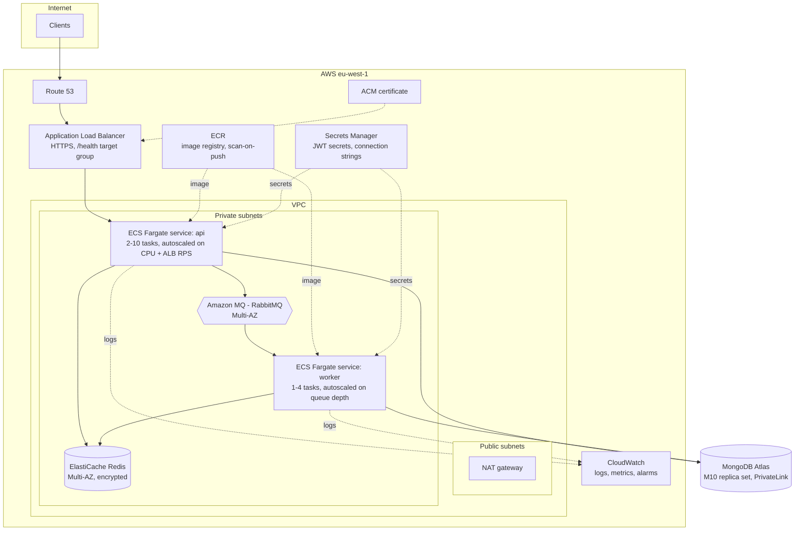

# Deployment

> **Scope note.** The repository ships a production-grade container build, a
> full CI pipeline, and the deployment design below. It is **not** provisioned
> against a live AWS account — the deploy job in `.github/workflows/ci.yml` is
> gated off (`if: false`) rather than pointed at credentials that do not exist.
> Everything else runs locally with a single `docker compose up`. This document
> describes what the target deployment is and why each piece is there.

## Target architecture (AWS)



### Why these components

**ECS Fargate over EC2 or Kubernetes.** The application is two long-running
containers. Fargate removes node patching and capacity planning entirely; EKS
would add a control plane and an operational surface this workload does not
justify. The same image runs both services with a different command, so there is
one artifact to build, scan and roll back.

**API and worker as separate services.** They have different scaling signals —
the API scales on request rate, the worker on queue depth — and separating them
means a notification backlog cannot degrade request latency.

**MongoDB Atlas rather than self-managed.** Managed backups, point-in-time
recovery and automated failover are the whole reason to pay for it. Connected
over PrivateLink so database traffic never traverses the public internet.

**Secrets in Secrets Manager, injected as container secrets.** Never baked into
the image, never in the task definition as plaintext environment variables.
`src/config/env.ts` validates them at boot, so a missing or malformed secret
fails the container's health check immediately rather than surfacing as a 500 on
the first request that needs it.

## CI/CD pipeline

`.github/workflows/ci.yml`, five stages:

| Stage       | What runs                                                                 | Gate                           |
| ----------- | ------------------------------------------------------------------------- | ------------------------------ |
| 1. Quality  | `eslint --max-warnings 0`, `tsc --noEmit`, `prettier --check`             | Any failure blocks             |
| 2. Test     | `vitest run --coverage` (in-memory replica set, stubbed Redis/RabbitMQ)   | Any failure blocks             |
| 3. Security | `npm audit --audit-level=high`, Trivy filesystem scan                     | High/critical advisories block |
| 4. Build    | Multi-stage Docker build, push to GHCR tagged `sha-<commit>` and `latest` | Requires 1–3, `main` only      |
| 5. Deploy   | Render ECS task definition, deploy, wait for stability                    | Environment-gated              |

### Practices worth calling out

**Parallel independent stages.** Quality, test and security have no dependency
on one another and run concurrently; only the build waits on all three. Feedback
on a lint error arrives in under a minute rather than behind the test suite.

**Concurrency cancellation.** A new push to a branch cancels the in-flight run
for that branch. There is no value in paying for CI on a commit that has already
been superseded.

**Immutable image tags.** Every build is tagged with the full commit SHA
alongside the moving `latest`. A rollback names an exact, existing artifact
instead of rebuilding and hoping the result is identical.

**Layer caching that reflects change frequency.** The Dockerfile copies
`package*.json` and runs `npm ci` before copying source, so the dependency layer
is reused until dependencies actually change. CI additionally caches BuildKit
layers in the Actions cache backend.

**OIDC federation instead of stored AWS keys.** The deploy job assumes a role via
`id-token: write`. No long-lived access keys exist in repository secrets to be
leaked or rotated.

**Environment gating.** The deploy targets a GitHub Environment, which is where
required reviewers and branch restrictions are configured. In this repository
that environment is deliberately absent.

**Deploy waits for stability.** `wait-for-service-stability` means the job fails
if the new tasks do not pass health checks — combined with the ECS deployment
circuit breaker, a bad release rolls back automatically instead of silently
half-deploying.

## Container hardening

The Dockerfile does five things that matter in production:

1. **Multi-stage build.** Compilers and dev dependencies stay in the builder
   stage; the runtime image carries only `dist/` and production `node_modules`.
2. **Non-root user.** Runs as `node`, never root.
3. **`dumb-init` as PID 1.** Node as PID 1 does not reap zombies or forward
   `SIGTERM` — without this the graceful shutdown handler in `src/server.ts`
   never runs, and every rolling deploy drops in-flight requests.
4. **`HEALTHCHECK` against `/health`.** Which reports MongoDB connectivity, so
   an unhealthy container is replaced rather than left serving errors.
5. **Pinned base image.** `node:22-alpine`, matching CI and the engines field.

## Graceful shutdown

On `SIGTERM` the API stops accepting connections, lets in-flight requests
finish, then closes the queue, broker, Redis and Mongo connections, with a 15s
hard-exit backstop. The worker waits for in-flight jobs to complete before
closing. Together with the ALB's deregistration delay this makes a rolling
deploy invisible to clients.

## Operational readiness

**Monitoring.** Structured JSON logs via pino to CloudWatch. The alarms that
matter: 5xx rate, p99 latency, ECS task restarts, BullMQ failed-job count,
RabbitMQ queue depth, Redis evictions, Atlas connections and disk.

**Backups.** Atlas continuous backup with point-in-time recovery, 7-day
retention. Restores should be rehearsed on a schedule — an untested backup is a
hypothesis, not a backup. Redis holds only cache, rate-limit counters and
refresh tokens; losing it logs everyone out and costs a cold cache, which is
survivable by design.

**Zero-downtime schema changes.** Additive-first: deploy code that tolerates
both shapes, backfill, then remove the old path. New indexes are built with
`background: true` on a secondary first.

**Secret rotation.** `JWT_ACCESS_SECRET` and `JWT_REFRESH_SECRET` rotate by
deploying support for a previous-secret fallback on verification, then switching
the signing secret, then removing the fallback once the old access-token TTL has
elapsed.

## Cost estimate

Rough monthly figures for a small production deployment in eu-west-1:

| Item                                       | Approx.         |
| ------------------------------------------ | --------------- |
| ECS Fargate — 2 API tasks (0.5 vCPU / 1GB) | ~$36            |
| ECS Fargate — 1 worker task                | ~$18            |
| ALB                                        | ~$20            |
| ElastiCache Redis `cache.t4g.micro`        | ~$12            |
| Amazon MQ `mq.t3.micro`                    | ~$15            |
| MongoDB Atlas M10                          | ~$57            |
| NAT gateway, ECR, CloudWatch               | ~$40            |
| **Total**                                  | **~$200/month** |

A staging environment on the same design, with single tasks and an Atlas M0, is
roughly a quarter of that.

## Running it locally

```bash
cp .env.example .env
docker compose up --build          # mongo (replica set), redis, rabbitmq, api, worker
npm run seed                       # load the JSON fixtures
curl localhost:3000/health
```

RabbitMQ's management UI is at http://localhost:15672 (guest/guest) — the
`notifications.fanout` queue there shows events flowing as you exercise the API.
