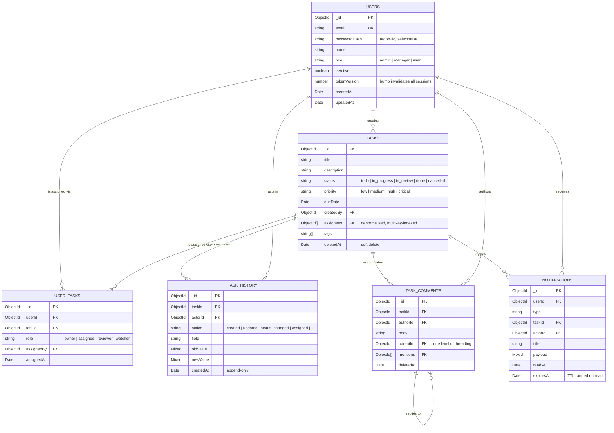

# Database Schema Design

MongoDB 7 via Mongoose 8. Six collections, chosen to keep the read paths that
matter cheap while preserving a trustworthy audit trail.

## Entity relationships



## The design decisions worth defending

### Why both `tasks.assignees` and a `user_tasks` collection

This looks like duplication. It is a deliberate trade, and the two halves
answer different questions.

`user_tasks` is the **source of truth for assignment metadata**: who assigned
whom, in what capacity (assignee, reviewer, watcher), and when. An array of ids
embedded in the task cannot express any of that, and the moment a per-assignment
field is needed — an estimate, an accepted-at timestamp, a per-person due date —
an embedded array has to be restructured. A unique compound index on
`{userId, taskId}` makes duplicate assignment impossible at the database level
rather than merely unlikely in application code.

`tasks.assignees` is a **read optimisation, and nothing else**. The single
hottest query in the system — "all tasks assigned to this user, filtered and
sorted" — becomes one multikey index scan over `tasks` instead of a lookup
through the join collection and back. At 10k tasks the difference is small; the
point is that it stays flat as the collection grows.

The cost is a consistency obligation, and it is discharged explicitly: both are
written inside one transaction in `syncAssignments()`
(`src/modules/tasks/task.service.ts`). Where transactions are unavailable (a
standalone mongod), the same code runs unsessioned and the reconciliation is
idempotent — `deleteMany` of stale rows, `bulkWrite` upsert of current ones — so
a re-run converges rather than compounding.

### Why history is a separate append-only collection

Embedding history in the task document would be simpler until it isn't. Mongo's
16MB document ceiling is a hard wall an active task's audit trail can approach;
more practically, an embedded array grows the document on every write, forcing
relocations and inflating every read of the task, including the ones that don't
want the history. A separate collection keeps task reads constant-size and lets
history be indexed for its own access pattern.

Nothing in the application ever updates or deletes a history document. That
immutability is the property that makes the collection usable as evidence.

### Soft delete on tasks and comments

`deletedAt` rather than a real delete, so history, comments and notifications
that reference a task stay meaningful. Hard delete exists, admin-only, and does
cascade — that path is for erasure requests, where destroying the audit trail is
the actual requirement.

### Partial TTL on notifications

The TTL index on `notifications.expiresAt` expires documents 30 days after
`expiresAt` is set — and it is only ever set when a notification is marked read.
Unread notifications therefore never expire. A blanket TTL on `createdAt` would
silently delete things the user has not seen; this keeps the collection bounded
without that failure mode.

## Indexing strategy

Every index below exists to serve a named query. An index that cannot be
attributed to a query is a write-amplification cost with no return.

| Collection      | Index                                                   | Query it serves                              |
| --------------- | ------------------------------------------------------- | -------------------------------------------- |
| `users`         | `{ email: 1 }` unique                                   | Login, duplicate-registration check          |
| `users`         | `{ role: 1, isActive: 1 }`                              | Admin/manager roster listings                |
| `tasks`         | `{ assignees: 1, deletedAt: 1, status: 1, dueDate: 1 }` | **`GET /tasks/user/:userId`** — the hot path |
| `tasks`         | `{ createdBy: 1, deletedAt: 1, status: 1 }`             | "Tasks I created", manager dashboards        |
| `tasks`         | `{ status: 1, dueDate: 1 }`                             | Cross-user reporting, due-soon sweeps        |
| `tasks`         | `{ tags: 1 }`                                           | Tag filtering                                |
| `tasks`         | `{ title: 'text', description: 'text' }` (weights 10/3) | `?q=` free-text search                       |
| `user_tasks`    | `{ userId: 1, taskId: 1 }` **unique**                   | Prevents duplicate assignment                |
| `user_tasks`    | `{ taskId: 1, role: 1 }`                                | "Who is on this task, in what capacity"      |
| `user_tasks`    | `{ userId: 1, assignedAt: -1 }`                         | A user's assignment history                  |
| `task_history`  | `{ taskId: 1, createdAt: -1 }`                          | Task timeline                                |
| `task_history`  | `{ actorId: 1, createdAt: -1 }`                         | Per-user activity feed; interactors pipeline |
| `task_history`  | `{ taskId: 1, action: 1, createdAt: -1 }`               | Filtered timelines (status changes only)     |
| `task_comments` | `{ taskId: 1, deletedAt: 1, createdAt: -1 }`            | Comment thread                               |
| `task_comments` | `{ parentId: 1, createdAt: 1 }`                         | Replies to a comment                         |
| `task_comments` | `{ authorId: 1, taskId: 1 }`                            | Interactors pipeline                         |
| `notifications` | `{ userId: 1, readAt: 1, createdAt: -1 }`               | The inbox query                              |
| `notifications` | `{ taskId: 1, createdAt: -1 }`                          | Task timeline                                |
| `notifications` | `{ expiresAt: 1 }` TTL 0s                               | Reaps read notifications                     |

### Compound key ordering: ESR

`{ assignees, deletedAt, status, dueDate }` is ordered **Equality → Sort →
Range**, which is what lets one index do all three jobs:

- `assignees` and `deletedAt` and `status` are matched by equality, so Mongo
  seeks directly to the relevant key range;
- `dueDate` sits last, serving both the range filter (`dueBefore`/`dueAfter`)
  and the sort.

Putting `dueDate` earlier would break the equality seek; putting `status` last
would force an in-memory `SORT` stage. The ordering is the whole point of the
index — verifying that no `SORT` stage appears in `explain()` is how you confirm
it is working.

### Verifying it

```bash
npm run seed && npm run explain
```

`scripts/explain.ts` runs the hot queries and prints the winning plan for each.
The pass condition is `IXSCAN` on every row — never `COLLSCAN` — with
`keysExamined` close to `nReturned`. A large gap between those two means the
index is being used but is not selective enough, which is a different bug from
having no index at all, and one that only shows up under real data volume.

Actual output against the seeded fixtures (30 tasks):

| query                                         | stage  | index chosen                                 | docsExamined | keysExamined | returned |
| --------------------------------------------- | ------ | -------------------------------------------- | ------------ | ------------ | -------- |
| tasks by assignee + status, sorted by dueDate | IXSCAN | `status_1_dueDate_1`                         | 6            | 6            | 3        |
| tasks by assignee + dueDate range             | IXSCAN | `assignees_1_deletedAt_1_status_1_dueDate_1` | 12           | 14           | 12       |
| task history timeline                         | IXSCAN | `taskId_1_createdAt_-1`                      | 5            | 5            | 5        |
| comments for a task, newest first             | IXSCAN | `taskId_1_deletedAt_1_createdAt_-1`          | 2            | 2            | 2        |

No `COLLSCAN` anywhere, and no in-memory `SORT` stage.

One honest caveat about the first row: the planner chose `status_1_dueDate_1`
rather than the four-field compound index. That is expected at this data
volume — with 30 documents both plans cost essentially nothing, so the planner's
choice between them carries no signal. The compound index demonstrably wins the
second query, which is the one that exercises the range-plus-sort path it was
designed for. Confirming the intended plan for the first query needs a
realistically sized collection; on a seed fixture, the meaningful assertion is
the one this table actually supports — every query is index-served, and none
sorts in memory.

## Aggregation pipelines

All three live in `src/modules/tasks/task.aggregations.ts`.

### 1. `getUserTasksPaginated` — the paginated, filtered task list

```
$match  (assignees + deletedAt + status/priority/tags/dueDate range/$text)
$facet
  ├─ data:  $sort → $skip → $limit → $lookup(users ×2) → $lookup(comment count)
  └─ total: $count
```

Two decisions carry this pipeline:

- **`$facet` runs the page and the count in one round trip.** The obvious
  alternative — `find()` plus `countDocuments()` — is two queries that can
  disagree with each other under concurrent writes, producing a total that does
  not match the page.
- **`$sort`/`$skip`/`$limit` come before every `$lookup`.** The joins then run
  against at most `limit` documents (≤100, enforced by the Zod schema) instead
  of the whole matched set. Reversing that order is the single most common way
  this pipeline gets written slowly.

### 2. `getTaskFullHistory` — one unified timeline

```
$match(task) → $lookup(task_history) → $lookup(task_comments) → $lookup(notifications)
             → $addFields: $sortArray($concatArrays(all three))
```

Status changes, comments and notifications have three different shapes. Each
`$lookup` sub-pipeline `$project`s its results into a common
`{ _id, type, at, actor, action, ... }` envelope, and `$concatArrays` +
`$sortArray` folds them into a single chronological array. The client receives
one document containing one timeline — which is what "a task's full history"
actually means to a consumer, rather than three lists to merge client-side.

Actor names are joined inside each sub-pipeline, projected down to
`{ _id, name, email, role }` so no password hash can escape through a `$lookup`.

### 3. `getTaskInteractors` — who touched this task

```
task_comments: $match → $project{userId, kind:'comment'}
  $unionWith(task_history: $match → $project{userId, kind: status_change|action})
  → $group by userId (types, counts, first/last interaction)
  → $lookup(users) → $sort(lastInteractionAt desc)
```

"Interacted" spans two collections, so `$unionWith` normalises both to
`{userId, kind, at}` and a single `$group` produces the per-user breakdown:
`commentCount`, `statusChangeCount`, the set of interaction types, and first/last
timestamps. Doing this in the database rather than merging two result sets in
Node keeps the grouping and de-duplication next to the data — and the payload
crossing the wire is one row per user rather than one row per interaction.

## Seed data

`seed/*.json` holds one structured JSON file per collection — 6 users, 30 tasks,
38 assignments, ~120 history entries, 20 comments, 25 notifications. Ids are
fixed rather than generated, so re-seeding is idempotent and the documented
`curl` examples keep working across runs.

```bash
npm run seed          # wipe and reload
npm run seed -- --keep  # insert without wiping
```

Passwords are stored in the fixture in plaintext (they are throwaway demo
credentials) and hashed at load time by `scripts/seed.ts` — a password hash is
never committed to the repository.
